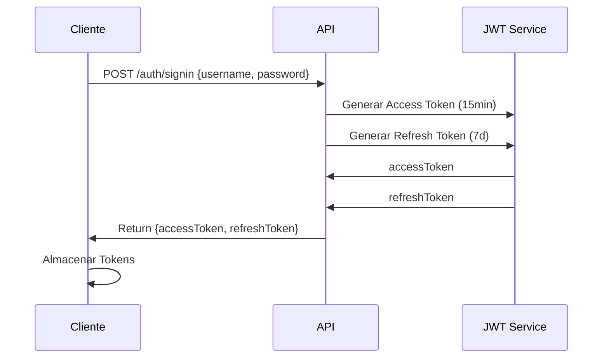
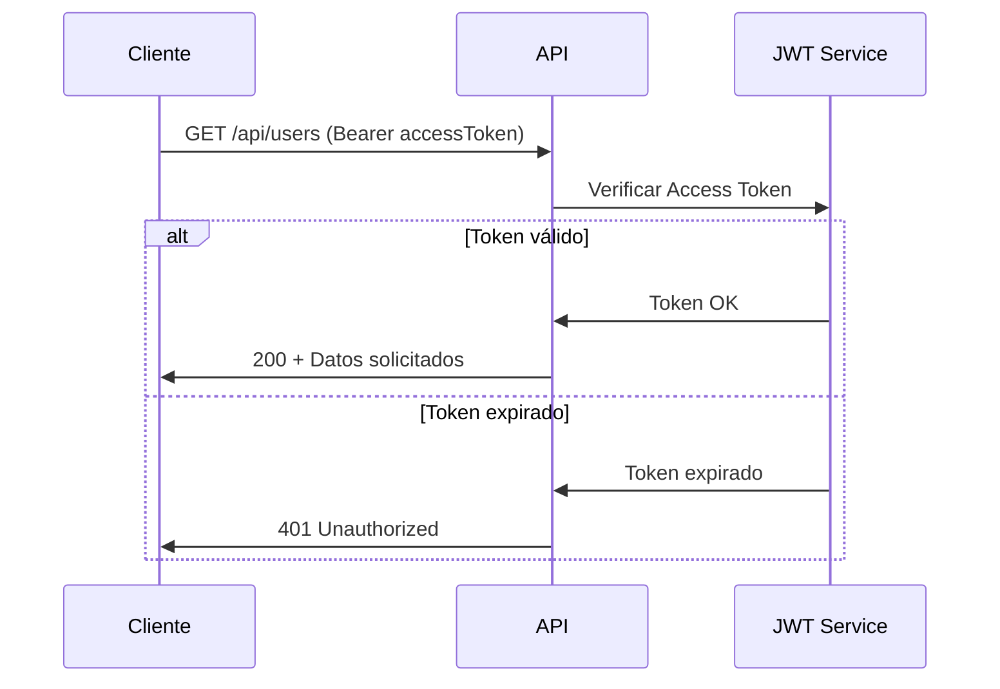
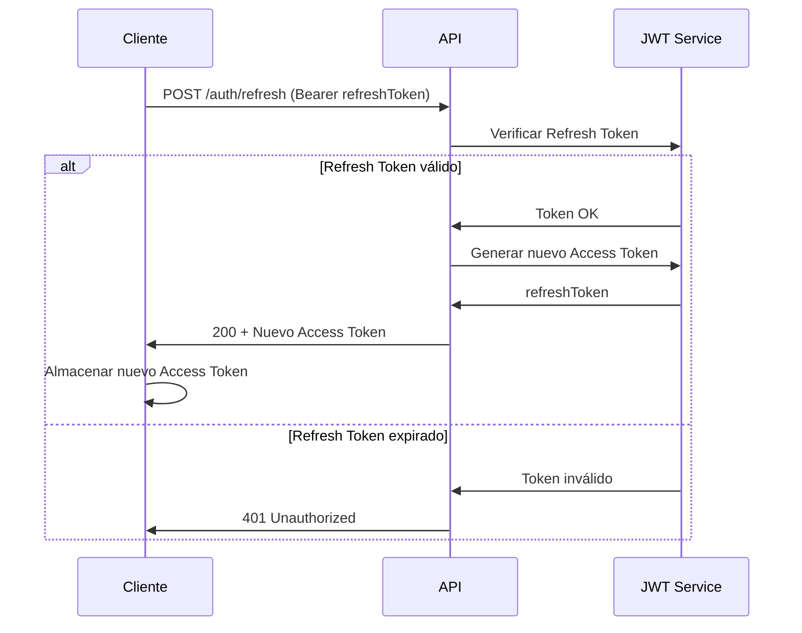

# AI

Claude AI
Copilot

import { Router } from "express";
const router = Router();

import * as authCtrl from "../controllers/auth.controller";
import { verifyRefreshToken, verifyToken } from "../middleware/auth.middleware";

/**
 * @swagger
 * /auth/signup:
 *   post:
 *     summary: Register a new user
 *     tags: [Auth]
 *     requestBody:
 *       required: true
 *       content:
 *         application/json:
 *           schema:
 *             type: object
 *             required: [name, email, password, organization]
 *             properties:
 *               name:
 *                 type: string
 *               email:
 *                 type: string
 *               password:
 *                 type: string
 *               organization:
 *                 type: string
 *     responses:
 *       201:
 *         description: User created successfully
 *       400:
 *         description: Missing fields or email already in use
 */
router.post("/signup", authCtrl.signup);

/**
 * @swagger
 * /auth/login:
 *   post:
 *     summary: Login with email and password
 *     tags: [Auth]
 *     requestBody:
 *       required: true
 *       content:
 *         application/json:
 *           schema:
 *             type: object
 *             required: [email, password]
 *             properties:
 *               email:
 *                 type: string
 *                 example: "manel@starkindustries.com"
 *               password:
 *                 type: string
 *                 example: "password123"
 *     responses:
 *       200:
 *         description: Login successful, returns accessToken
 *       401:
 *         description: Invalid credentials
 */
router.post("/login", authCtrl.login);

/**
 * @swagger
 * /auth/refresh:
 *   post:
 *     summary: Refresh access token using refresh token cookie
 *     tags: [Auth]
 *     responses:
 *       200:
 *         description: Returns new accessToken
 *       403:
 *         description: No refresh token provided
 */
router.post("/refresh", verifyRefreshToken, authCtrl.refresh);

/**
 * @swagger
 * /auth/logout:
 *   post:
 *     summary: Logout and clear refresh token cookie
 *     tags: [Auth]
 *     responses:
 *       200:
 *         description: Logout successful
 */
router.post("/logout", authCtrl.logout);

/**
 * @swagger
 * /auth/me:
 *   get:
 *     summary: Get current authenticated user
 *     tags: [Auth]
 *     security:
 *       - bearerAuth: []
 *     responses:
 *       200:
 *         description: Returns user data
 *       401:
 *         description: Unauthorized
 *       404:
 *         description: User not found
 */
router.get("/me", verifyToken, authCtrl.getMe);

export default router;

import mongoose from 'mongoose';
import { UserModel } from '../models/user.model';
import { generateAccessToken, generateRefreshToken, verifyRefreshToken } from '../utils/jwt.util';

export const validateUserCredentials = async (email: string, password: string) => {
    const user = await UserModel.findOne({ email });
    if (!user) return null;
    if (user.password !== password) return null;
    return user;
};

export const getTokens = (user: any) => {
    const accessToken = generateAccessToken(
        String(user._id),
        user.name,
        user.email,
        user.role,
        user.organization as mongoose.Types.ObjectId
    );
    const refreshToken = generateRefreshToken(
        String(user._id),
        user.name,
        user.email,
        user.role,
        user.organization as mongoose.Types.ObjectId
    );
    return { accessToken, refreshToken };
};

export const refreshUserSession = async (incomingRefreshToken: string) => {
    const payload = verifyRefreshToken(incomingRefreshToken);
    const user = await UserModel.findById(payload.id);
    if (!user) throw new Error('User not found');
    return getTokens(user);
};


import { Request, Response, NextFunction } from 'express';
import jwt from 'jsonwebtoken';
import { IJwtPayload } from '../models/JWTPayload';
import { config } from '../config/config';

export async function verifyToken(req: Request, res: Response, next: NextFunction) {
    const authHeader = req.headers['authorization'];
    const token = authHeader && authHeader.split(' ')[1];

    if (!token)
        return res.status(403).json({ message: "No token provided" });

    try {
        const decoded = jwt.verify(token, config.jwt.accessSecret) as IJwtPayload;

        if (decoded.type !== 'access')
            return res.status(401).json({ message: "Invalid token type - Access token required" });

        (req as any).userId = decoded.id;
        (req as any).userRole = decoded.role;
        (req as any).organization = decoded.organization;
        res.locals.UserId = decoded.id;

        next();
    } catch (error) {
        return res.status(401).json({ message: "Unauthorized" });
    }
}

export async function isOwner(req: Request, res: Response, next: NextFunction) {
    try {
        const userIdRequest = (req as any).userId;
        const userId = req.params.userId;

        if (userId !== userIdRequest)
            return res.status(403).json({ message: "Not Owner" });

        next();
    } 
    catch (error) {
        return res.status(500).json({ message: error });
    }
}

export function isAdmin(req: Request, res: Response, next: NextFunction) {
    try {
        const role = (req as any).userRole;
        if (role !== 'admin')
            return res.status(403).json({ message: 'Admin access required' });
        next();
    }
    catch (error) {
        return res.status(500).json({ message: error });
    }
}

export async function verifyRefreshToken(req: Request, res: Response, next: NextFunction) {
    const refreshToken = req.cookies?.[config.cookies.refreshName];

    if (!refreshToken)
        return res.status(403).json({ message: "No refresh token provided" });

    try {
        const decoded = jwt.verify(refreshToken, config.jwt.refreshSecret) as IJwtPayload;

        if (decoded.type !== 'refresh')
            return res.status(401).json({ message: "Invalid token type - Refresh token required" });

        (req as any).userId = decoded.id;
        (req as any).userRole = decoded.role;
        res.locals.UserId = decoded.id;

        next();
    } 
    catch (error) {
        return res.status(401).json({ message: "Invalid refresh token" });
    }
}

export function requireRole(...roles: string[]) {
    return (req: Request, res: Response, next: NextFunction) => {
        const role = (req as any).userRole;
        if (!role || !roles.includes(role)) {
            return res.status(403).json({ message: `Access denied. Required role: ${roles.join(' or ')}` });
        }
        next();
    };
}

export function isOwnerOrAdminOrg(req: Request, res: Response, next: NextFunction) {
    const userIdFromToken = (req as any).userId;
    const userRole = (req as any).userRole;
    const userOrg = (req as any).organization; // organization from token
    const userIdParam = req.params.userId;
    const orgIdParam = req.params.organizationId; // if route includes orgId

    if (userIdFromToken === userIdParam) {
        return next();
    }

    if (userRole === 'admin' && userOrg && orgIdParam && String(userOrg) === String(orgIdParam)) {
        return next();
    }

    return res.status(403).json({ message: "Forbidden: not owner or org admin" });
}

export function isOrgMember(req: Request, res: Response, next: NextFunction) {
    const userRole = (req as any).userRole;
    const userOrg = (req as any).organization;
    const orgId = req.params.organizationId;

    if (userRole === 'admin') {
        return next();
    }

    if (userOrg && String(userOrg) === String(orgId)) {
        return next();
    }

    return res.status(403).json({
        message: 'Forbidden: not a member of this organization'
    });
}

export function isOrgAdmin(req: Request, res: Response, next: NextFunction) {
    const userRole = (req as any).userRole;
    const userOrg = (req as any).organization;
    const orgId = req.params.organizationId;

    if (userRole !== 'admin') {
        return res.status(403).json({ message: 'Admin role required' });
    }

    if (!userOrg || String(userOrg) !== String(orgId)) {
        return res.status(403).json({
            message: 'Forbidden: admin from another organization'
        });
    }
    next();
}


# EA API REST + JWT con Express y TypeScript

Este proyecto implementa una API REST con autenticación JWT usando Express y TypeScript. Incluye manejo de tokens de acceso y refresh tokens para una mejor seguridad.

 npx ts-node saveAllFilesToTxt.ts

## Estructura del Proyecto

```
├── src/
│   ├── controllers/
│   │   ├── auth.controller.ts    # Controladores de autenticación
│   │   └── user.controller.ts    # Controladores de usuarios
│   ├── middlewares/
│   │   ├── joi.ts                 # Middlewares de autenticación
│   │   └── auth.middleware.ts           # Middlewares de autenticación y autorización
│   ├── models/
│   │   ├── JWTPayload.ts        # Interface para payload JWT
│   │   ├── auth.model.ts        # Interface de autenticación
│   │   ├── organitzation.model.ts # Interface de organización
│   │   └── user.model.ts        # Interface de Usuario
│   ├── routes/
│   │   ├── auth.route.ts              # Rutas de autenticación
│   │   ├── organization.route.ts      # Rutas de organización
│   │   └── user.route.ts              # Rutas de usuarios
│   ├── services/
│   │   ├── organitzation.service.ts # Servicio de organización
│   │   └── user.service.ts      # Servicio de usuarios
│   ├── config/
│   │   └── config.ts
│   ├── data/
│   │   ├── organitzation.json
│   │   └── user.json              
│   ├── utils/
│   │   └── dataSeeder.util.ts 
│   ├── app.ts                   # Configuración de Express
│   ├── server.ts                
│   └── swagger.ts               # Configuración de Swagger
├── test/
│   └── api.http                # Tests de API con REST Client
└── package.json
```

## Requisitos Previos

- Node.js (versión 14.x o superior)
- npm (incluido con Node.js)
- TypeScript instalado globalmente:


Instalar dependencias
```
npm install
```

## Uso

1. Compilar el proyecto:
```
npm run build
```

2. Iniciar el servidor:
```
npm start
```

El servidor se iniciará en http://localhost:4000

## Endpoints de la API

### Autenticación

- POST `/api/auth/signup`: Registro de nuevo usuario
- POST `/api/auth/signin`: Inicio de sesión
- POST `/api/auth/refresh`: Renovar access token

### Usuarios

- GET `/api/users`: Obtener todos los usuarios
- GET `/api/users/:id`: Obtener usuario específico
- PUT `/api/users/:id`: Actualizar usuario (requiere autenticación y ser propietario)
- DELETE `/api/users/:id`: Eliminar usuario (requiere autenticación y ser propietario)

## Testing

El proyecto incluye un archivo `api.http` para testing usando la extensión REST Client de VS Code. Este archivo contiene ejemplos de todas las peticiones posibles y guarda automáticamente los tokens JWT para su reutilización.

## Implementación de JWT

El sistema implementa un esquema de autenticación dual con:

1. Access Token:
   - Duración corta (15 minutos)
   - Usado para autenticar operaciones en la API
   - Contiene el tipo 'access' en el payload

2. Refresh Token:
   - Duración larga (7 días)
   - Usado solo para obtener nuevos access tokens
   - Contiene el tipo 'refresh' en el payload

Los tokens se validan a través de middlewares:
- `verifyToken`: Valida access tokens
- `verifyRefreshToken`: Valida refresh tokens
- `isOwner`: Verifica que el usuario sea propietario del recurso

# Diagramas de Secuencia - Flujo de Autenticación JWT

## Inicio de sesión


## Llamada a API Protegida


## Renovación del Access Token



## Referencias

- [Implementando sistema JWT con TypeScript y Node](https://nozzlegear.com/blog/implementing-a-jwt-auth-system-with-typescript-and-node)
- [Extender objeto Request de Express](https://dev.to/kwabenberko/extend-express-s-request-object-with-typescript-declaration-merging-1nn5)

